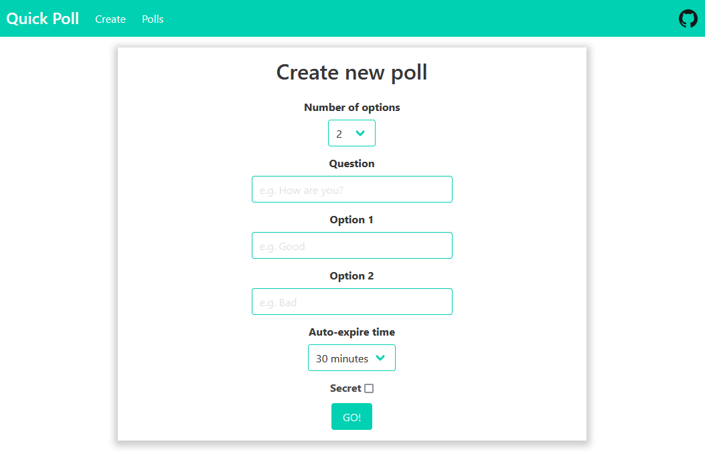

# Quick Poll

Source code for the Quick Poll website, where you can easily create and share temporary polls.

- Backend: Python using Bottle micro-framework
- Frontend: HTML with Bulma providing good looks
- All data stored on Redis server
- Site hosted on Render

## Images

